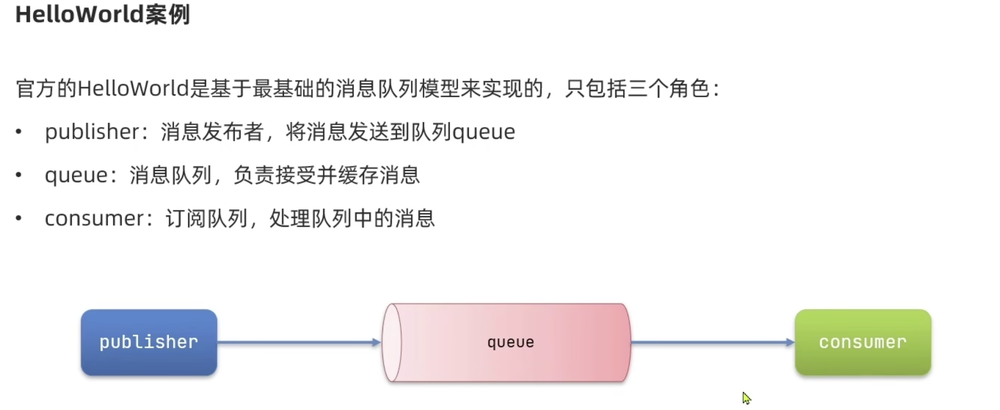

# GuliMall
谷粒商城项目

### 环境配置：

- ubuntu安装docker：

  ```
  curl -fsSL get.docker.com -o get-docker.sh
  sudo sh get-docker.sh --mirror Aliyun
  
  //启动docker
  systemctl enable docker
  systemctl start docker
  ```

- 安装mysql

  ```
  docker pull --platform linux/amd64 mysql
  
  //启动mysql容器
  docker run -p 3306:3306 --name mysql \
  -v /mydata/mysql/log:/var/log/mysql \
  -v /mydata/mysql/data:/var/lib/mysql \
  -v /mydata/mysql/conf:/etc/mysql  \
  -e MYSQL_ROOTPASSWORD=root \
  -d mysql:5.7
  ```

  M1 芯片有bug，直接在主机使用docker安装mysql

  ```yaml
  version: "3.9"
  services:
    db:
      container_name: mysql57
      image: mysql/mysql-server:5.7
      environment:
        MYSQL_DATABASE: 'db'
        MYSQL_ROOT_PASSWORD: 'root'
        MYSQL_ROOT_HOST: '%'
      ports:
        - '3306:3306'
      expose:
        - '3306'
      volumes:
        - './mydata/mysql/data:/var/lib/mysql'
        - './initial.sql:/docker-entrypoint-initdb.d/initial.sql'
        - './mysql_5.1.7/SQLDATA:/SQLDATA'
        - './mydata/mysql/conf:/etc/mysql'
  
    # for WebUI
    adminer:
      image: adminer:4.8.1
      ports:
        - "10010:8080"
  
  ```


- 安装redis

  ```
  docker pull redis
  ```

- 配置git

  ```
  git config --global user.name  ""
  git config --global user.email ""
  
  ssh-keygen -t rsa -C "email" 
  ```

### 创建项目微服务

商品服务、仓储服务、订单服务、优惠券服务、用户服务

共同点：

1）web，openfeign

2）每一个服务包名都是`com.gulimall.xxx`（product/order/ware/coupon/member)

3）模块名 gulimall-xxx

  


导入数据库文件


### 使用人人开源搭建后台管理系统

```
git clone https://gitee.com/renrenio/renren-fast.git
```


将lombok 版本修改为：`1.8.20`

```
git clone https://gitee.com/renrenio/renren-fast-vue.git
```


M1 芯片运行时需要将node版本降级：

```
解决方法：将node版本降低为14
1.安装版本控制工具： sudo npm install n -g
2.安装14版本：sudo n 14
  ps:安装稳定版本 sudo n stable
     安装最新版本 sudo n latest
3.npm install --ignore-scripts (执行前删除node-modules)
```

renren-fast-vue 报错：


```
npm install --save node-sass --unsafe-perm=true --allow-root
```


安装代码生成器：

```
git clone https://gitee.com/renrenio/renren-generator.git
```

 springboot2.6及以后的版本要在yml加上

```
spring:
  main:
    allow-circular-references: true
```

要不然会报一个循环引用的错误

使用 renren-generator 生成代码 然后放入之前创建的模块


生成代码后将 `UndoLogEntity`中的Longblob修改为 `byte`，java无法识别Longblob


这里遇到一个bug：


是因为把`renren-generator`中的`@RequestMapping("${moduleName}/${pathName}")`注释掉了。

### springCloud Alibaba

Spring Cloud Alibaba 致力于提供微服务开发的一站式解决方案。此项目包含开发分布式应用 微服务的必需组件，方便开发者通过 Spring Cloud 编程模型轻松使用这些组件来开发分布 式应用服务。

依托 Spring Cloud Alibaba，您只需要添加一些注解和少量配置，就可以将 Spring Cloud 应用 接入阿里微服务解决方案，通过阿里中间件来迅速搭建分布式应用系统。

SpringCloud 部分组件停止维护和更新，给开发带来不便;
 SpringCloud 部分环境搭建复杂，没有完善的可视化界面，我们需要大量的二次开发和定制 SpringCloud 配置复杂，难以上手，部分配置差别难以区分和合理应用


结合 **SpringCloud Alibaba** 最终的技术搭配方案: 

**SpringCloud Alibaba - Nacos**:注册中心(服务发现**/**注册) 

**SpringCloud Alibaba - Nacos**:配置中心(动态配置管理) 

**SpringCloud - Ribbon**:负载均衡

**SpringCloud - Feign**:声明式 

**HTTP** 客户端(调用远程服务) 

**SpringCloud Alibaba - Sentinel**:服务容错(限流、降级、熔断)

**SpringCloud - Gateway**:**API** 网关(**webflux** 编程模式) 

**SpringCloud - Sleuth**:调用链监控

**SpringCloud Alibaba - Seata**:原 **Fescar**，即分布式事务解决方案


##### Nacos 使用

在 common 中引入依赖：

```xml
 <dependencyManagement>
        <dependencies>
            <dependency>
                <groupId>com.alibaba.cloud</groupId>
                <artifactId>spring-cloud-alibaba-dependencies</artifactId>
                <version>2021.0.4.0</version>
                <type>pom</type>
                <scope>import</scope>
            </dependency>
        </dependencies>
</dependencyManagement>
```

配置 Nacos Server 地址

```
spring:
	  cloud:
    nacos:
      discovery:
        server-addr: http://localhost:8848
```

在springboot启动类使用 **@EnableDiscoveryClient** 注解开启服务注册与发现功能


这里需要下载nacos客户端 http://127.0.0.1:8848

启动命令：`sh startup.sh -m standalone`代表以非集群方式启动


这里使用的版本号：

```
spring-cloud-alibaba-dependencies： 2021.0.1.0
spring-cloud：2021.0.1
springboot：2.6.11
nacos客户端：2.2.0
```


### 使用 feign进行远程调用

引入 `openfeign`依赖，当前服务就可以远程调用其他服务

```
<dependency>
			<groupId>org.springframework.cloud</groupId>
			<artifactId>spring-cloud-starter-openfeign</artifactId>
</dependency>
```

然后编写一个接口，告诉SpringCloud这个接口需要调用远程服务。

所有需要远程调用的接口放在`feign`包中


`FeignClient`注解表示需要调用的远程服务名，然后声明接口的每一个方法都是调用哪个远程服务的哪个请求。

接口中放需要远程调用的签名，注解中需要其完整的路径。

```
@RequestMapping("/coupon/coupon/member/list")
public R memberCoupons();
```

使用`@EnableFeignClient`开启远程调用的功能.


这里启动时会报一个error：


**SpringCloud Feign在Hoxton.M2 RELEASED版本之后不再使用Ribbon而是使用spring-cloud-loadbalancer，所以不引入spring-cloud-loadbalancer会报错**

引入依赖：

```
<dependency>
   <groupId>org.springframework.cloud</groupId>
   <artifactId>spring-cloud-loadbalancer</artifactId>
</dependency>
```


- Nacos 配置中心

  给common 中引入依赖

  ```
  <dependency>
      <groupId>com.alibaba.cloud</groupId>
      <artifactId>spring-cloud-starter-alibaba-nacos-config</artifactId>
  </dependency>
  ```

  在应用的 /src/main/resources/bootstrap.properties 配置文件中配置 Nacos Config 元数据

  ```
  spring.application.name=gulimall-coupon
  spring.cloud.nacos.config.server-addr=127.0.0.1:8848
  ```

  如果需要对 Bean 进行动态刷新，请参照 Spring 和 Spring Cloud 规范。推荐给类添加 `@RefreshScope` 或 `@ConfigurationProperties ` 注解。这里使用`@RefreshScope`

  这里遇到了一个无法引入`bootstrap.properties`的问题，可以通过降低springboot版本或者添加依赖解决这个问题

  ```
  <dependency>
              <groupId>org.springframework.cloud</groupId>
              <artifactId>spring-cloud-starter-bootstrap</artifactId>
              <version>3.1.0</version>
  </dependency>
  ```

  创建配置文件：

  

  这里的`Data id`与bootstrap.properties 配置文件中的`spring.application.name`+“.properties”

- nacos 命名空间与配置分组

  在配置中心创建命名空间
  
  
  
  在生产环境中创建新的配置
  
  
  
  在bootstrap.properties中添加`spring.cloud.nacos.config.namespace`可以切换配置文件，利用命名空间可以做环境隔离。
  
  可以基于环境或者基于微服务做隔离。
  
  任何文件都可以放在配置中心中，只需要在bootstrap.properties 中说明加载配置中心的哪些配置即可。配置中心中有的优先使用配置中心中的文件。
  
- **网关服务**

  1.开启服务注册发现：`@EnableDiscoveryClient，配置nacos的注册中心地址
  
  启动网关服务时，spring-cloud-starter-gateway和spring-boot-starter-web依赖发生冲突，因为gateway依赖包内置spring-boot-starter-webflux依赖，与web包内的spring-boot-starter-webflux依赖起了冲突。在 application.properties中添加配置
  
  ```
  spring.main.web-application-type=reactive
  ```
  
  2.gateway配置
  
  ```
    cloud:
      gateway:
        routes:
          - id: test_route
            uri: http://www.baidu.com
            predicates:
              - Query=url,baidu
  
          - id: qq_route
            uri: https://www.qq.com
            predicates:
              - Query=url,qq
  ```


### 安装RabbitMQ

`docker pull rabbitmq:3.9.7-management`

镜像安装完成后启动rabbitmq中的插件：`rabbitmq-plugins enable rabbitmq_management`


- 入门案例

  


### 前端基础

安装vue2:`npm install vue@2.7.14 `

```html
<!DOCTYPE html>
<html lang="en">

<head>
    <meta charset="UTF-8">
    <meta http-equiv="X-UA-Compatible" content="IE=edge">
    <meta name="viewport" content="width=device-width, initial-scale=1.0">
    <title>Document</title>
</head>

<body>
    <div id="app">
        Hello World, {{name}} is handsome
    </div>

</body>

<script src="./node_modules/vue/dist/vue.js"></script>
<script>
    const vm = new Vue({
        el: "#app",
        data: {
            name: "张三"
        }
    })
</script>
</html>
```

数据绑定`v-model`，模型的变化会引起视图的变化，即实现双向绑定

```html
<!DOCTYPE html>
<html lang="en">

<head>
    <meta charset="UTF-8">
    <meta http-equiv="X-UA-Compatible" content="IE=edge">
    <meta name="viewport" content="width=device-width, initial-scale=1.0">
    <title>Document</title>
</head>

<body>
    <div id="app">
        <input type="text" v-model="num" />
        <h1> Hello World, {{name}} is handsome，有 {{num}} 人为他点赞</h1>
    </div>

</body>

<script src="./node_modules/vue/dist/vue.js"></script>
<script>
    const vm = new Vue({
        el: "#app",
        data: {
            name: "张三",
            num: 0
        }
    })
</script>

</html>
```


使用`v-on`绑定事件

```html
<!DOCTYPE html>
<html lang="en">

<head>
    <meta charset="UTF-8">
    <meta http-equiv="X-UA-Compatible" content="IE=edge">
    <meta name="viewport" content="width=device-width, initial-scale=1.0">
    <title>Document</title>
</head>

<body>
    <div id="app">
        <button v-on:click="num++">点赞</button>
        <h1> Hello World, {{name}} is handsome，有 {{num}} 人为他点赞</h1>
    </div>

</body>

<script src="./node_modules/vue/dist/vue.js"></script>
<script>
    const vm = new Vue({
        el: "#app",
        data: {
            name: "张三",
            num: 0
        }
    })
</script>

</html>
```


`v-text`与`v-html`

```html
<!DOCTYPE html>
<html lang="en">

<head>
    <meta charset="UTF-8">
    <meta http-equiv="X-UA-Compatible" content="IE=edge">
    <meta name="viewport" content="width=device-width, initial-scale=1.0">
    <title>Document</title>
</head>

<body>
    <div id="app">
        <span v-html="msg"> {{msg}} <br /></span>
        <span v-text="msg"> {{msg}} <br /></span>
    </div>

</body>
<script src="./node_modules/vue/dist/vue.js"></script>
<script>
    const vm = new Vue({
        el: "#app",
        data: {
            msg: "<h1>Hello World<h1/>",
        },

    })
</script>

</html>
```


使用`v-bind`绑定 href

```html
<!DOCTYPE html>
<html lang="en">

<head>
    <meta charset="UTF-8">
    <meta http-equiv="X-UA-Compatible" content="IE=edge">
    <meta name="viewport" content="width=device-width, initial-scale=1.0">
    <title>Document</title>
</head>

<body>
    <div id="app">
        <a v-bind:href="link">gogogo</a>
    </div>
</body>

<script src="./node_modules/vue/dist/vue.js"></script>
<script>
    const vm = new Vue({
        el: "#app",
        data: {
            link: "http://www.baidu.com"
        }
    })
</script>
</html>
```


```html
<!DOCTYPE html>
<html lang="en">

<head>
    <meta charset="UTF-8">
    <meta http-equiv="X-UA-Compatible" content="IE=edge">
    <meta name="viewport" content="width=device-width, initial-scale=1.0">
    <title>Document</title>
</head>

<body>
    <div id="app">
        <a v-bind:href="link">gogogo</a><br />
        设置颜色：<input v-model="setColor" type="text">
        <span v-bind:class="{active:isActive,'text-danger':hasError}" v-bind:style="{color: setColor}">你好</span>
    </div>
</body>

<script src="./node_modules/vue/dist/vue.js"></script>
<script>
    const vm = new Vue({
        el: "#app",
        data: {
            link: "http://www.baidu.com",
            isActive: true,
            hasError: true,
            setColor: 'red'
        }
    })
</script>

</html>
```


`v-model`可以实现双向绑定


vue组件化

```html
<!DOCTYPE html>
<html lang="en">

<head>
    <meta charset="UTF-8">
    <meta http-equiv="X-UA-Compatible" content="IE=edge">
    <meta name="viewport" content="width=device-width, initial-scale=1.0">
    <title>Document</title>
</head>


<body>
    <div id="app">
        <button @click="count++">被点击了 {{count}} 次</button>
        <counter />
    </div>
</body>

<script src="../node_modules/vue/dist/vue.js"></script>

<script>
    //1.全局声明注册一个组件
    Vue.component("counter", {
        template: `<button @click="count++">被点击了 {{count}} 次</button>`,
        data () {
            return {
                count: 1
            }
        }
    })
    const vm = new Vue({
        el: "#app",
        data: {
            count: 0
        }
    })
</script>
</html>
```


生命周期：

每个Vue实例被创建时都需要经过一系列的初始化过程：创建实例，装载模版等。Vue为生命周期中的每个状态都设置了钩子函数（舰艇函数），每当Vue实例处于不同的生命周期时，对应的函数都会被触发调用。


- vue模块化开发：

  安装webpack：`npm install webpack -g`

  选装vue脚手架：`npm install -g @vue/cli-init`

  初始化 vue 项目：`vue init webpack appname`，vue脚手架使用webpack模版初始化一个appname项目


### 商品服务

##### 三级分类

```java
 private List<CategoryEntity> getChildrens(CategoryEntity root, List<CategoryEntity> all) {

        List<CategoryEntity> children = all.stream().filter(categoryEntity -> {
            return categoryEntity.getParentCid().equals(root.getCatId());
        }).map(categoryEntity -> {
            //递归寻找子分类
            categoryEntity.setChildren(getChildrens(categoryEntity,all));
            return categoryEntity;
        }).sorted((menu1,menu2) -> {
            //分类排序
            return (menu1.getSort() == null ? 0 : menu1.getSort()) - (menu2.getSort() == null ? 0 : menu2.getSort());
        }).collect(Collectors.toList());

        return children;

    }
```


在后台中的彩单管理功能处创建商品系统下的分类维护菜单


在编写相应的前端代码时首先将后台的`renren-fast`注册到nacos，并将前端所有的请求转发到`gateway`


在后台`gateway`模块进行配置，对路由进行重写：

```
  cloud:
    gateway:
      routes:
        - id: admin_route
          uri: lb://renren-fast
          predicates:
            - Path=/api/**
          filters:
            ##http://localhost:88/api/captcha.jpg => http://localhost:8080/renren-fast/captcha.jpg
            - RewritePath=/api/(?<segment>.*),/renren-fast/$\{segment}
```

这里可能会遇到一个错误


在网关服务pom文件添加以下依赖

        <dependency>
            <groupId>org.springframework.cloud</groupId>
            <artifactId>spring-cloud-starter-loadbalancer</artifactId>
        </dependency>

SpringCloud Feign在Hoxton.M2 RELEASED版本之后不再使用Ribbon而是使用spring-cloud-loadbalancer	

`gateway`中遇到跨域问题时，添加过滤器

```java
package com.gulimall.gateway.config;

import org.springframework.context.annotation.Bean;
import org.springframework.context.annotation.Configuration;
import org.springframework.web.cors.reactive.CorsWebFilter;
import org.springframework.web.cors.reactive.UrlBasedCorsConfigurationSource;

@Configuration
public class CorsConfiguration {
    @Bean
    public CorsWebFilter corsWebFilter() {
        UrlBasedCorsConfigurationSource source = new UrlBasedCorsConfigurationSource();

        org.springframework.web.cors.CorsConfiguration corsConfiguration = new org.springframework.web.cors.CorsConfiguration();

        //1、配置跨域
        corsConfiguration.addAllowedHeader("*");
        corsConfiguration.addAllowedMethod("*");
        corsConfiguration.addAllowedOriginPattern("*");
        corsConfiguration.setAllowCredentials(true);

        source.registerCorsConfiguration("/**",corsConfiguration);
        return new CorsWebFilter(source);
    }
}

```

配置路由文件时需要把精确的放在位置靠前

```
  cloud:
    gateway:
      routes:
        - id: product_route
          uri:  lb://gulimall-product
          predicates:
            - Path=/api/product/**
          filters:
            - RewritePath=/api/(?<segment>.*),/$\{segment}

        - id: admin_route
          uri: lb://renren-fast
          predicates:
            - Path=/api/**
          filters:
            - RewritePath=/api/(?<segment>.*),/renren-fast/$\{segment}
```

前端代码：

```vue
<template>
   <div>
    <el-tree :data="menus" :props="defaultProps" @node-click="handleNodeClick"></el-tree> 
   </div>
  </template>
  
  <script>
    export default {
      created() {
        this.getMenus()
      },
      data() {
      return {
        menus: [],
        defaultProps: {
          children: 'children',
          label: 'name'
        }
      };
    },
    
    methods: {
      handleNodeClick(data) {
        console.log(data);
      },

      // 获取菜单信息
      getMenus(){
        this.axios({
          method:'get',
          url:  '/api/product/category/list/tree',
        }).then((data) => {
          console.log(data.data.data)
          this.menus = data.data.data

        })

      }
    }
    }
  </script>
```

这里使用axios，需要在`main.js`中加入:

```js
import axios from 'axios'
Vue.prototype.axios = axios
axios.defaults.baseURL = 'http://localhost:88'
```

实现分类维护页面展示所有分类的信息：


添加新增与删除功能，这里的删除使用逻辑删除。


使用`show_status`表示逻辑删除位，配置全局逻辑删除规则

```
mybatis-plus:
  mapper-locations: classpath:/mapper/**/*.xml
  global-config:
    db-config:
      id-type: auto  #主键自增
      logic-delete-value: 1 #表示已删除
      logic-not-delete-value: 0 #表示未删除
```

并给Bean加上逻辑删除注解`@TableLogic`

```
/**
* 是否显示[0-不显示，1显示]
*/
@TableLogic
private Integer showStatus;
```

