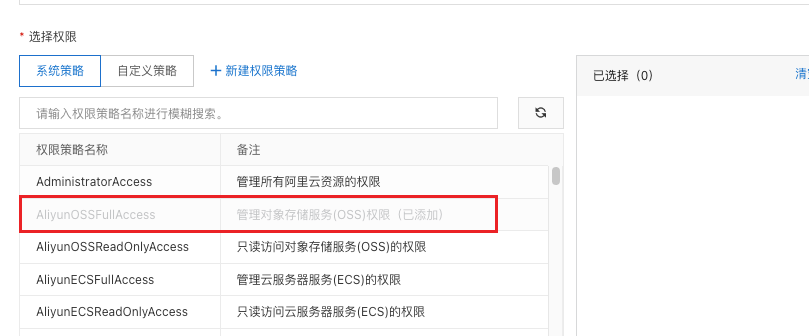
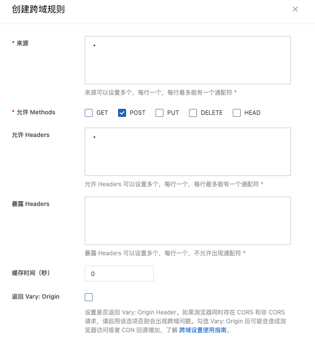

# GuliMall
谷粒商城项目

### 环境配置：

- ubuntu安装docker：

  ```
  curl -fsSL get.docker.com -o get-docker.sh
  sudo sh get-docker.sh --mirror Aliyun
  
  //启动docker
  systemctl enable docker
  systemctl start docker
  ```

- 安装mysql

  ```
  docker pull --platform linux/amd64 mysql
  
  //启动mysql容器
  docker run -p 3306:3306 --name mysql \
  -v /mydata/mysql/log:/var/log/mysql \
  -v /mydata/mysql/data:/var/lib/mysql \
  -v /mydata/mysql/conf:/etc/mysql  \
  -e MYSQL_ROOTPASSWORD=root \
  -d mysql:5.7
  ```

  M1 芯片有bug，直接在主机使用docker安装mysql

  ```yaml
  version: "3.9"
  services:
    db:
      container_name: mysql57
      image: mysql/mysql-server:5.7
      environment:
        MYSQL_DATABASE: 'db'
        MYSQL_ROOT_PASSWORD: 'root'
        MYSQL_ROOT_HOST: '%'
      ports:
        - '3306:3306'
      expose:
        - '3306'
      volumes:
        - './mydata/mysql/data:/var/lib/mysql'
        - './initial.sql:/docker-entrypoint-initdb.d/initial.sql'
        - './mysql_5.1.7/SQLDATA:/SQLDATA'
        - './mydata/mysql/conf:/etc/mysql'
  
    # for WebUI
    adminer:
      image: adminer:4.8.1
      ports:
        - "10010:8080"
  
  ```


- 安装redis

  ```
  docker pull redis
  ```

- 配置git

  ```
  git config --global user.name  ""
  git config --global user.email ""
  
  ssh-keygen -t rsa -C "email" 
  ```

### 创建项目微服务

商品服务、仓储服务、订单服务、优惠券服务、用户服务

共同点：

1）web，openfeign

2）每一个服务包名都是`com.gulimall.xxx`（product/order/ware/coupon/member)

3）模块名 gulimall-xxx

  


导入数据库文件


### 使用人人开源搭建后台管理系统

```
git clone https://gitee.com/renrenio/renren-fast.git
```


将lombok 版本修改为：`1.8.20`

```
git clone https://gitee.com/renrenio/renren-fast-vue.git
```


M1 芯片运行时需要将node版本降级：

```
解决方法：将node版本降低为14
1.安装版本控制工具： sudo npm install n -g
2.安装14版本：sudo n 14
  ps:安装稳定版本 sudo n stable
     安装最新版本 sudo n latest
3.npm install --ignore-scripts (执行前删除node-modules)
```

renren-fast-vue 报错：


```
npm install --save node-sass --unsafe-perm=true --allow-root
```


安装代码生成器：

```
git clone https://gitee.com/renrenio/renren-generator.git
```

 springboot2.6及以后的版本要在yml加上

```
spring:
  main:
    allow-circular-references: true
```

要不然会报一个循环引用的错误

使用 renren-generator 生成代码 然后放入之前创建的模块


生成代码后将 `UndoLogEntity`中的Longblob修改为 `byte`，java无法识别Longblob


这里遇到一个bug：


是因为把`renren-generator`中的`@RequestMapping("${moduleName}/${pathName}")`注释掉了。

### springCloud Alibaba

Spring Cloud Alibaba 致力于提供微服务开发的一站式解决方案。此项目包含开发分布式应用 微服务的必需组件，方便开发者通过 Spring Cloud 编程模型轻松使用这些组件来开发分布 式应用服务。

依托 Spring Cloud Alibaba，您只需要添加一些注解和少量配置，就可以将 Spring Cloud 应用 接入阿里微服务解决方案，通过阿里中间件来迅速搭建分布式应用系统。

SpringCloud 部分组件停止维护和更新，给开发带来不便;
 SpringCloud 部分环境搭建复杂，没有完善的可视化界面，我们需要大量的二次开发和定制 SpringCloud 配置复杂，难以上手，部分配置差别难以区分和合理应用


结合 **SpringCloud Alibaba** 最终的技术搭配方案: 

**SpringCloud Alibaba - Nacos**:注册中心(服务发现**/**注册) 

**SpringCloud Alibaba - Nacos**:配置中心(动态配置管理) 

**SpringCloud - Ribbon**:负载均衡

**SpringCloud - Feign**:声明式 

**HTTP** 客户端(调用远程服务) 

**SpringCloud Alibaba - Sentinel**:服务容错(限流、降级、熔断)

**SpringCloud - Gateway**:**API** 网关(**webflux** 编程模式) 

**SpringCloud - Sleuth**:调用链监控

**SpringCloud Alibaba - Seata**:原 **Fescar**，即分布式事务解决方案


##### Nacos 使用

在 common 中引入依赖：

```xml
 <dependencyManagement>
        <dependencies>
            <dependency>
                <groupId>com.alibaba.cloud</groupId>
                <artifactId>spring-cloud-alibaba-dependencies</artifactId>
                <version>2021.0.4.0</version>
                <type>pom</type>
                <scope>import</scope>
            </dependency>
        </dependencies>
</dependencyManagement>
```

配置 Nacos Server 地址

```
spring:
	  cloud:
    nacos:
      discovery:
        server-addr: http://localhost:8848
```

在springboot启动类使用 **@EnableDiscoveryClient** 注解开启服务注册与发现功能


这里需要下载nacos客户端 http://127.0.0.1:8848

启动命令：`sh startup.sh -m standalone`代表以非集群方式启动


这里使用的版本号：

```
spring-cloud-alibaba-dependencies： 2021.0.1.0
spring-cloud：2021.0.1
springboot：2.6.11
nacos客户端：2.2.0
```


### 使用 feign进行远程调用

引入 `openfeign`依赖，当前服务就可以远程调用其他服务

```
<dependency>
			<groupId>org.springframework.cloud</groupId>
			<artifactId>spring-cloud-starter-openfeign</artifactId>
</dependency>
```

然后编写一个接口，告诉SpringCloud这个接口需要调用远程服务。

所有需要远程调用的接口放在`feign`包中


`FeignClient`注解表示需要调用的远程服务名，然后声明接口的每一个方法都是调用哪个远程服务的哪个请求。

接口中放需要远程调用的签名，注解中需要其完整的路径。

```
@RequestMapping("/coupon/coupon/member/list")
public R memberCoupons();
```

使用`@EnableFeignClient`开启远程调用的功能.


这里启动时会报一个error：


**SpringCloud Feign在Hoxton.M2 RELEASED版本之后不再使用Ribbon而是使用spring-cloud-loadbalancer，所以不引入spring-cloud-loadbalancer会报错（无法获取到验证码的bug 503）**

引入依赖：

```
<dependency>
   <groupId>org.springframework.cloud</groupId>
   <artifactId>spring-cloud-loadbalancer</artifactId>
</dependency>
```


- Nacos 配置中心

  给common 中引入依赖

  ```
  <dependency>
      <groupId>com.alibaba.cloud</groupId>
      <artifactId>spring-cloud-starter-alibaba-nacos-config</artifactId>
  </dependency>
  ```

  在应用的 /src/main/resources/bootstrap.properties 配置文件中配置 Nacos Config 元数据

  ```
  spring.application.name=gulimall-coupon
  spring.cloud.nacos.config.server-addr=127.0.0.1:8848
  ```

  如果需要对 Bean 进行动态刷新，请参照 Spring 和 Spring Cloud 规范。推荐给类添加 `@RefreshScope` 或 `@ConfigurationProperties ` 注解。这里使用`@RefreshScope`

  这里遇到了一个无法引入`bootstrap.properties`的问题，可以通过降低springboot版本或者添加依赖解决这个问题

  ```
  <dependency>
              <groupId>org.springframework.cloud</groupId>
              <artifactId>spring-cloud-starter-bootstrap</artifactId>
              <version>3.1.0</version>
  </dependency>
  ```

  创建配置文件：

  

  这里的`Data id`与bootstrap.properties 配置文件中的`spring.application.name`+“.properties”

- nacos 命名空间与配置分组

  在配置中心创建命名空间
  
  
  
  在生产环境中创建新的配置
  
  
  
  在bootstrap.properties中添加`spring.cloud.nacos.config.namespace`可以切换配置文件，利用命名空间可以做环境隔离。
  
  可以基于环境或者基于微服务做隔离。
  
  任何文件都可以放在配置中心中，只需要在bootstrap.properties 中说明加载配置中心的哪些配置即可。配置中心中有的优先使用配置中心中的文件。
  
- **网关服务**

  1.开启服务注册发现：`@EnableDiscoveryClient，配置nacos的注册中心地址
  
  启动网关服务时，spring-cloud-starter-gateway和spring-boot-starter-web依赖发生冲突，因为gateway依赖包内置spring-boot-starter-webflux依赖，与web包内的spring-boot-starter-webflux依赖起了冲突。在 application.properties中添加配置
  
  ```
  spring.main.web-application-type=reactive
  ```
  
  2.gateway配置
  
  ```
    cloud:
      gateway:
        routes:
          - id: test_route
            uri: http://www.baidu.com
            predicates:
              - Query=url,baidu
  
          - id: qq_route
            uri: https://www.qq.com
            predicates:
              - Query=url,qq
  ```


### 安装RabbitMQ

`docker pull rabbitmq:3.9.7-management`

镜像安装完成后启动rabbitmq中的插件：`rabbitmq-plugins enable rabbitmq_management`


- 入门案例

  


### 前端基础

安装vue2:`npm install vue@2.7.14 `

```html
<!DOCTYPE html>
<html lang="en">

<head>
    <meta charset="UTF-8">
    <meta http-equiv="X-UA-Compatible" content="IE=edge">
    <meta name="viewport" content="width=device-width, initial-scale=1.0">
    <title>Document</title>
</head>

<body>
    <div id="app">
        Hello World, {{name}} is handsome
    </div>

</body>

<script src="./node_modules/vue/dist/vue.js"></script>
<script>
    const vm = new Vue({
        el: "#app",
        data: {
            name: "张三"
        }
    })
</script>
</html>
```

数据绑定`v-model`，模型的变化会引起视图的变化，即实现双向绑定

```html
<!DOCTYPE html>
<html lang="en">

<head>
    <meta charset="UTF-8">
    <meta http-equiv="X-UA-Compatible" content="IE=edge">
    <meta name="viewport" content="width=device-width, initial-scale=1.0">
    <title>Document</title>
</head>

<body>
    <div id="app">
        <input type="text" v-model="num" />
        <h1> Hello World, {{name}} is handsome，有 {{num}} 人为他点赞</h1>
    </div>

</body>

<script src="./node_modules/vue/dist/vue.js"></script>
<script>
    const vm = new Vue({
        el: "#app",
        data: {
            name: "张三",
            num: 0
        }
    })
</script>

</html>
```


使用`v-on`绑定事件

```html
<!DOCTYPE html>
<html lang="en">

<head>
    <meta charset="UTF-8">
    <meta http-equiv="X-UA-Compatible" content="IE=edge">
    <meta name="viewport" content="width=device-width, initial-scale=1.0">
    <title>Document</title>
</head>

<body>
    <div id="app">
        <button v-on:click="num++">点赞</button>
        <h1> Hello World, {{name}} is handsome，有 {{num}} 人为他点赞</h1>
    </div>

</body>

<script src="./node_modules/vue/dist/vue.js"></script>
<script>
    const vm = new Vue({
        el: "#app",
        data: {
            name: "张三",
            num: 0
        }
    })
</script>

</html>
```


`v-text`与`v-html`

```html
<!DOCTYPE html>
<html lang="en">

<head>
    <meta charset="UTF-8">
    <meta http-equiv="X-UA-Compatible" content="IE=edge">
    <meta name="viewport" content="width=device-width, initial-scale=1.0">
    <title>Document</title>
</head>

<body>
    <div id="app">
        <span v-html="msg"> {{msg}} <br /></span>
        <span v-text="msg"> {{msg}} <br /></span>
    </div>

</body>
<script src="./node_modules/vue/dist/vue.js"></script>
<script>
    const vm = new Vue({
        el: "#app",
        data: {
            msg: "<h1>Hello World<h1/>",
        },

    })
</script>

</html>
```


使用`v-bind`绑定 href

```html
<!DOCTYPE html>
<html lang="en">

<head>
    <meta charset="UTF-8">
    <meta http-equiv="X-UA-Compatible" content="IE=edge">
    <meta name="viewport" content="width=device-width, initial-scale=1.0">
    <title>Document</title>
</head>

<body>
    <div id="app">
        <a v-bind:href="link">gogogo</a>
    </div>
</body>

<script src="./node_modules/vue/dist/vue.js"></script>
<script>
    const vm = new Vue({
        el: "#app",
        data: {
            link: "http://www.baidu.com"
        }
    })
</script>
</html>
```


```html
<!DOCTYPE html>
<html lang="en">

<head>
    <meta charset="UTF-8">
    <meta http-equiv="X-UA-Compatible" content="IE=edge">
    <meta name="viewport" content="width=device-width, initial-scale=1.0">
    <title>Document</title>
</head>

<body>
    <div id="app">
        <a v-bind:href="link">gogogo</a><br />
        设置颜色：<input v-model="setColor" type="text">
        <span v-bind:class="{active:isActive,'text-danger':hasError}" v-bind:style="{color: setColor}">你好</span>
    </div>
</body>

<script src="./node_modules/vue/dist/vue.js"></script>
<script>
    const vm = new Vue({
        el: "#app",
        data: {
            link: "http://www.baidu.com",
            isActive: true,
            hasError: true,
            setColor: 'red'
        }
    })
</script>

</html>
```


`v-model`可以实现双向绑定


vue组件化

```html
<!DOCTYPE html>
<html lang="en">

<head>
    <meta charset="UTF-8">
    <meta http-equiv="X-UA-Compatible" content="IE=edge">
    <meta name="viewport" content="width=device-width, initial-scale=1.0">
    <title>Document</title>
</head>


<body>
    <div id="app">
        <button @click="count++">被点击了 {{count}} 次</button>
        <counter />
    </div>
</body>

<script src="../node_modules/vue/dist/vue.js"></script>

<script>
    //1.全局声明注册一个组件
    Vue.component("counter", {
        template: `<button @click="count++">被点击了 {{count}} 次</button>`,
        data () {
            return {
                count: 1
            }
        }
    })
    const vm = new Vue({
        el: "#app",
        data: {
            count: 0
        }
    })
</script>
</html>
```


生命周期：

每个Vue实例被创建时都需要经过一系列的初始化过程：创建实例，装载模版等。Vue为生命周期中的每个状态都设置了钩子函数（舰艇函数），每当Vue实例处于不同的生命周期时，对应的函数都会被触发调用。


- vue模块化开发：

  安装webpack：`npm install webpack -g`

  选装vue脚手架：`npm install -g @vue/cli-init`

  初始化 vue 项目：`vue init webpack appname`，vue脚手架使用webpack模版初始化一个appname项目


### 商品服务

##### 三级分类

```java
 private List<CategoryEntity> getChildrens(CategoryEntity root, List<CategoryEntity> all) {

        List<CategoryEntity> children = all.stream().filter(categoryEntity -> {
            return categoryEntity.getParentCid().equals(root.getCatId());
        }).map(categoryEntity -> {
            //递归寻找子分类
            categoryEntity.setChildren(getChildrens(categoryEntity,all));
            return categoryEntity;
        }).sorted((menu1,menu2) -> {
            //分类排序
            return (menu1.getSort() == null ? 0 : menu1.getSort()) - (menu2.getSort() == null ? 0 : menu2.getSort());
        }).collect(Collectors.toList());

        return children;

    }
```


在后台中的彩单管理功能处创建商品系统下的分类维护菜单


在编写相应的前端代码时首先将后台的`renren-fast`注册到nacos，并将前端所有的请求转发到`gateway`


在后台`gateway`模块进行配置，对路由进行重写：

```
  cloud:
    gateway:
      routes:
        - id: admin_route
          uri: lb://renren-fast
          predicates:
            - Path=/api/**
          filters:
            ##http://localhost:88/api/captcha.jpg => http://localhost:8080/renren-fast/captcha.jpg
            - RewritePath=/api/(?<segment>.*),/renren-fast/$\{segment}
```

这里可能会遇到一个错误


在网关服务pom文件添加以下依赖

        <dependency>
            <groupId>org.springframework.cloud</groupId>
            <artifactId>spring-cloud-starter-loadbalancer</artifactId>
        </dependency>

SpringCloud Feign在Hoxton.M2 RELEASED版本之后不再使用Ribbon而是使用spring-cloud-loadbalancer	

`gateway`中遇到跨域问题时，添加过滤器

```java
package com.gulimall.gateway.config;

import org.springframework.context.annotation.Bean;
import org.springframework.context.annotation.Configuration;
import org.springframework.web.cors.reactive.CorsWebFilter;
import org.springframework.web.cors.reactive.UrlBasedCorsConfigurationSource;

@Configuration
public class CorsConfiguration {
    @Bean
    public CorsWebFilter corsWebFilter() {
        UrlBasedCorsConfigurationSource source = new UrlBasedCorsConfigurationSource();

        org.springframework.web.cors.CorsConfiguration corsConfiguration = new org.springframework.web.cors.CorsConfiguration();

        //1、配置跨域
        corsConfiguration.addAllowedHeader("*");
        corsConfiguration.addAllowedMethod("*");
        corsConfiguration.addAllowedOriginPattern("*");
        corsConfiguration.setAllowCredentials(true);

        source.registerCorsConfiguration("/**",corsConfiguration);
        return new CorsWebFilter(source);
    }
}

```

配置路由文件时需要把精确的放在位置靠前

```
  cloud:
    gateway:
      routes:
        - id: product_route
          uri:  lb://gulimall-product
          predicates:
            - Path=/api/product/**
          filters:
            - RewritePath=/api/(?<segment>.*),/$\{segment}

        - id: admin_route
          uri: lb://renren-fast
          predicates:
            - Path=/api/**
          filters:
            - RewritePath=/api/(?<segment>.*),/renren-fast/$\{segment}
```

前端代码：

```vue
<template>
   <div>
    <el-tree :data="menus" :props="defaultProps" @node-click="handleNodeClick"></el-tree> 
   </div>
  </template>
  
  <script>
    export default {
      created() {
        this.getMenus()
      },
      data() {
      return {
        menus: [],
        defaultProps: {
          children: 'children',
          label: 'name'
        }
      };
    },
    
    methods: {
      handleNodeClick(data) {
        console.log(data);
      },

      // 获取菜单信息
      getMenus(){
        this.axios({
          method:'get',
          url:  '/api/product/category/list/tree',
        }).then((data) => {
          console.log(data.data.data)
          this.menus = data.data.data

        })

      }
    }
    }
  </script>
```

这里使用axios，需要在`main.js`中加入:

```js
import axios from 'axios'
Vue.prototype.axios = axios
axios.defaults.baseURL = 'http://localhost:88'
```

实现分类维护页面展示所有分类的信息：


添加新增与删除功能，这里的删除使用逻辑删除。


使用`show_status`表示逻辑删除位，配置全局逻辑删除规则

```
mybatis-plus:
  mapper-locations: classpath:/mapper/**/*.xml
  global-config:
    db-config:
      id-type: auto  #主键自增
      logic-delete-value: 1 #表示已删除
      logic-not-delete-value: 0 #表示未删除
```

并给Bean加上逻辑删除注解`@TableLogic`

```
/**
* 是否显示[0-不显示，1显示]
*/
@TableLogic
private Integer showStatus;
```

##### 品牌服务

- 品牌状态快速开关

  对逆向生成的代码进行优化，实现品牌状态快速修改

  vue代码：

  ```vue
   <template slot-scope="scope">
            <el-switch
              v-model="scope.row.showStatus"
              active-color="#13ce66"
              :active-value="1"
              :inactive-value="0"
              @change="updateBrandStatus(scope.row)"
            >
            </el-switch>
  </template>
  ```
  
  用户点击 switch 开关就会调用后台的接口更改对应数据库的字段 ( 决定是否显示)，定义了 @change 事件 只要修后就会触发对应方法
  
    ```javascript
    // 更新brandStatus 状态
    updateBrandStatus (data) {
          console.log(`最新信息:`, data)
          console.log("showStatus:", data.showStatus)
          let { brandId, showStatus } = data
          this.$http({
            url: this.$http.adornUrl('/product/brand/update/status'),
            method: 'post',
            data: this.$http.adornData({ brandId, showStatus: showStatus == 1 ? 1 : 0 }, false)
          }).then(({ data }) => {
            this.$message({
              type: 'success',
              message: '状态修改成功'
            })
  
          })
        },
    ```
  
  


- 品牌图片上传功能

  

  在阿里云开通对象存储服务

  

  创建一个bucket

  

使用服务端签名后直传的文件上传模式


创建阿里云子账并为其分配权限



[阿里云Java上传文件概述](https://help.aliyun.com/document_detail/32013.html)

导入sdk依赖：

```
<dependency>
    <groupId>com.aliyun.oss</groupId>
    <artifactId>aliyun-sdk-oss</artifactId>
    <version>3.15.1</version>
</dependency>
```

测试上传文件流：

```java
@Test
	void uploadFile(){
		// Endpoint以华东1（杭州）为例，其它Region请按实际情况填写。
		String endpoint = "https://oss-cn-hangzhou.aliyuncs.com";
		// 阿里云账号AccessKey拥有所有API的访问权限，风险很高。强烈建议您创建并使用RAM用户进行API访问或日常运维，请登录RAM控制台创建RAM用户。
		String accessKeyId = "xxx";
		String accessKeySecret = "xxx";
		// 填写Bucket名称，例如examplebucket。
		String bucketName = "xxx";
		// 填写Object完整路径，完整路径中不能包含Bucket名称，例如exampledir/exampleobject.txt。
		String objectName = "product/brand/1.jpg";
		// 填写本地文件的完整路径，例如D:\\localpath\\examplefile.txt。
		// 如果未指定本地路径，则默认从示例程序所属项目对应本地路径中上传文件流。
		String filePath= "/Users/null/Downloads/1.jpg";

		// 创建OSSClient实例。
		OSS ossClient = new OSSClientBuilder().build(endpoint, accessKeyId, accessKeySecret);

		try {
			InputStream inputStream = new FileInputStream(filePath);
			// 创建PutObjectRequest对象。
			PutObjectRequest putObjectRequest = new PutObjectRequest(bucketName, objectName, inputStream);
			// 设置该属性可以返回response。如果不设置，则返回的response为空。
			putObjectRequest.setProcess("true");
			// 创建PutObject请求。
			PutObjectResult result = ossClient.putObject(putObjectRequest);
			// 如果上传成功，则返回200。
			System.out.println(result.getResponse().getStatusCode());
			System.out.println("upload success");
		} catch (OSSException oe) {
			System.out.println("Caught an OSSException, which means your request made it to OSS, "
					+ "but was rejected with an error response for some reason.");
			System.out.println("Error Message:" + oe.getErrorMessage());
			System.out.println("Error Code:" + oe.getErrorCode());
			System.out.println("Request ID:" + oe.getRequestId());
			System.out.println("Host ID:" + oe.getHostId());
		} catch (ClientException | FileNotFoundException ce) {
			System.out.println("Caught an ClientException, which means the client encountered "
					+ "a serious internal problem while trying to communicate with OSS, "
					+ "such as not being able to access the network.");
			System.out.println("Error Message:" + ce.getMessage());
		} finally {
			if (ossClient != null) {
				ossClient.shutdown();
			}
		}
	}
```

在该项目中使用springcloudAlibaba封装好的starter，向`common`中的pom文件导入依赖

```xml
<dependency>
    <groupId>com.alibaba.cloud</groupId>
    <artifactId>spring-cloud-starter-alicloud-oss</artifactId>
    <version>2.1.0.RELEASE</version>
</dependency>
```

[说明文档](https://github.com/alibaba/spring-cloud-alibaba/blob/v2.1.0.RELEASE/spring-cloud-alibaba-examples/oss-example/readme-zh.md)

在配置文件中配置相关的信息


获取签名代码：

```java
   @RequestMapping("/oss/policy")
    public Map<String,String> policy(){


        // 填写Host地址，格式为https://bucketname.endpoint。
        String host = "https://" + bucket + "." + endpoint;
        // 设置上传回调URL，即回调服务器地址，用于处理应用服务器与OSS之间的通信。OSS会在文件上传完成后，把文件上传信息通过此回调URL发送给应用服务器。
        //String callbackUrl = "https://192.168.0.0:8888";
        // 设置上传到OSS文件的前缀，可置空此项。置空后，文件将上传至Bucket的根目录下。
        String format = new SimpleDateFormat("yyyy-MM-dd").format(new Date(System.currentTimeMillis()));
        String dir = format + "/";

        // 创建ossClient实例。
        OSS ossClient = new OSSClientBuilder().build(endpoint, accessId, accessKey);

        Map<String, String> respMap = null;
        try {
            long expireTime = 30;
            long expireEndTime = System.currentTimeMillis() + expireTime * 1000;
            Date expiration = new Date(expireEndTime);
            PolicyConditions policyConds = new PolicyConditions();
            policyConds.addConditionItem(PolicyConditions.COND_CONTENT_LENGTH_RANGE, 0, 1048576000);
            policyConds.addConditionItem(MatchMode.StartWith, PolicyConditions.COND_KEY, dir);

            String postPolicy = ossClient.generatePostPolicy(expiration, policyConds);
            byte[] binaryData = postPolicy.getBytes("utf-8");
            String encodedPolicy = BinaryUtil.toBase64String(binaryData);
            String postSignature = ossClient.calculatePostSignature(postPolicy);

            respMap = new LinkedHashMap<String, String>();
            respMap.put("accessId", accessId);
            respMap.put("policy", encodedPolicy);
            respMap.put("signature", postSignature);
            respMap.put("dir", dir);
            respMap.put("host", host);
            respMap.put("expire", String.valueOf(expireEndTime / 1000));


            // respMap.put("expire", formatISO8601Date(expiration));

            //JSONObject jasonCallback = new JSONObject();
            //jasonCallback.put("callbackUrl", callbackUrl);
            //jasonCallback.put("callbackBody",
            //        "filename=${object}&size=${size}&mimeType=${mimeType}&height=${imageInfo.height}&width=${imageInfo.width}");
            //jasonCallback.put("callbackBodyType", "application/x-www-form-urlencoded");
            //String base64CallbackBody = BinaryUtil.toBase64String(jasonCallback.toString().getBytes());
            //respMap.put("callback", base64CallbackBody);

            JSONObject ja1 = JSONObject.fromObject(respMap);
            return respMap;
        } catch (Exception e) {
            // Assert.fail(e.getMessage());
            System.out.println(e.getMessage());
        }
        return respMap;
    }
}
```


在网关添加配置：

```
- id: thirdParty_route
  uri: lb://gulimall-thirdParty
  predicates:
    - Path=/api/thirdParty/**
  filters:
    - RewritePath=/api/thirdParty(?<segment>.*),/$\{segment}
```

这里为了方便获取到返回的数据，在后台controller中将签名返回的对象编写为R

```java
 return R.ok().put("data",respMap);
```

在客户端向阿里云上传文件的时候还会遇到跨域的问题


在阿里云中配置跨域规则




这里遇到一个小bug，在配置文件中的`spring.cloud.alicloud.oss.endpoint`在后台获取其内容时会自动加上`https://`所以在配置文件中使用`spring.cloud.alicloud.oss.endpoints`设置值。

- 在前端显示上传的图片

  ```
  <template slot-scope="scope">
    
  </template>
  ```

- 新增品牌时对填写的字段进行校验

  前端的表单校验

  ```
  <el-form
        :rules="dataRule"
  >
  ```

  ```
  firstLetter: [
            {
              validator: (rule, value, callback) => {
                if (value === '') {
                  callback(new Error('首字母必须填写'))
                } else if (!/^[a-zA-z]$/.test(value)) {
                  callback(new Error('必须为字母'))
                } else {
                  callback()
                }
              }, trigger: 'blur'
            }
          ],
          sort: [
            {
              validator: (rule, value, callback) => {
                if (value === '') {
                  callback(new Error('排序字段必须填写'))
                } else if (!Number.isInteger(value) || value < 0) {
                  callback(new Error('排序字段必须为大于等于0的整数'))
                } else {
                  callback()
                }
              }, trigger: 'blur'
            }
          ]
  ```

  后端使用JSR303进行后端校验

  先给`Brand`实体标注校验注解，然后在`controller`处标注`@Valid`表示进行验证

  

  

给校验的bean后紧跟一个BindingResult就可以获取到校验的结果

```java
 @RequestMapping("/save")
      public R save(@Valid @RequestBody BrandEntity brand, BindingResult result){
brandService.save(brand);

      return R.ok();
  }
```

- 统一异常处理

  

  在common中创建一个exction的枚举类来表示相应的错误定义

  ```java
  package com.gulimall.common.exception;
  
  /**
   * 错误码列表
   * 10:通用
   *  001：参数格式化校验
   *  11：商品
   *  12：订单
   *  13：购物车
   *  14：物流
   *
   */
  public enum BizCodeEnum {
      /**
       * 系统未知异常
       */
      UNKNOWN_EXCEPTION(10000, "系统未知异常"),
      /**
       * 参数校验错误
       */
      VALID_EXCEPTION(10001, "参数格式校验失败"),
      TO_MANY_REQUEST(10002, "请求流量过大，请稍后再试"),
      SMS_CODE_EXCEPTION(10002, "验证码获取频率太高，请稍后再试"),
      PRODUCT_UP_EXCEPTION(11000, "商品上架异常"),
      USER_EXIST_EXCEPTION(15001, "存在相同的用户"),
      PHONE_EXIST_EXCEPTION(15002, "存在相同的手机号"),
      NO_STOCK_EXCEPTION(21000, "商品库存不足"),
      LOGIN_ACCOUNT_PASSWORD_EXCEPTION(15003, "账号或密码错误"),
              ;
  
  
      private int code;
      private String msg;
      BizCodeEnum(int code, String msg) {
          this.code = code;
          this.msg = msg;
      }
  
      public int getCode() {
          return code;
      }
  
      public String getMsg() {
          return msg;
      }
  }
  
  ```

  为product模块编写统一异常处理代码

  ```java
  @Slf4j
  @RestControllerAdvice(basePackages = "com.gulimall.product.controller") //@ResponseBody + @ControllerAdvice
  public class GulimallExceptionControllerAdvice {
  
  
      @ExceptionHandler(value= Exception.class)
      public R handleValidException(MethodArgumentNotValidException e){
          //log.error("数据校验出现问题：{},异常类型：{}",e.getMessage(),e.getClass());
          BindingResult result = e.getBindingResult();
  
          Map<String,String> errorMap = new HashMap<String,String>();
          result.getFieldErrors().forEach((fieldError)->{
              errorMap.put(fieldError.getField(),fieldError.getDefaultMessage());
          });
          return R.error(BizCodeEnum.VALID_EXCEPTION.getCode(),BizCodeEnum.VALID_EXCEPTION.getMsg()).put("error",errorMap);
      }
  
      @ExceptionHandler(value= Throwable.class)
      public R handleException(Throwable e){
          return R.error(BizCodeEnum.UNKNOWN_EXCEPTION.getCode(),BizCodeEnum.UNKNOWN_EXCEPTION.getMsg());
      }
  }
  ```

  

- 分组校验

  给校验注解标注什么情况需要进行校验

  ```java
  @TableId
  	@NotNull(message = "修改必须指定品牌ID",groups ={UpdateGroup.class} )
  	@Null(message = "新增不能指定品牌ID",groups = {AddGroup.class})
  	private Long brandId;
  ```

  使用`@Validated`注解标注表示使用分组校验

  

- 编写自定义校验注解

  添加依赖：

  ```
  <dependency>
      <groupId>javax.validation</groupId>
      <artifactId>validation-api</artifactId>
  </dependency>
  ```

  